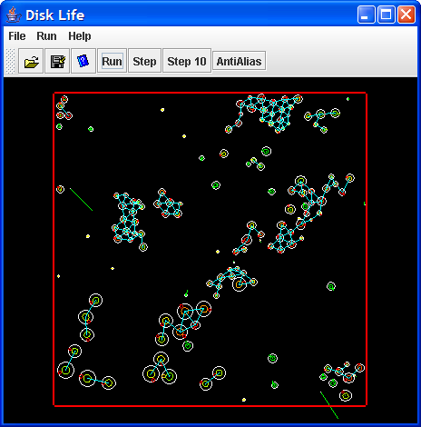

# DiskLife
Disk Life does a 2-d pool table like simulation on "Disk Creatures". Most of the time in this program went into the physics simulation and not the creatures. The physics engine does a time accurate collision model ( event model with time of collision calculated ). The collision detection algorithm is a "sift and prune" O(N) algorithm whereas brute force pairwise algorithms are O(N^2). The creatures react simply by getting damaged from a collision and create a spring connecting any two colliding disks that can break if stretched too far. When a creature dies an energy disk is created in its place.

